# 🏥 NexQueue - Smart Healthcare Queue Management System


> **Skip the Queue. Meet the Cure.**
> 
> A real-time, priority-based patient queue optimization system that reduces waiting time by 60%.

---

## 📋 **Table of Contents**
- [✨ Features](#-features)
- [🛠️ Tech Stack](#️-tech-stack)
- [📸 Screenshots](#-screenshots)
- [🚀 Live Demo](#-live-demo)
- [💻 Installation](#-installation)
- [🔧 Configuration](#-configuration)
- [👥 User Roles](#-user-roles)
- [📊 How It Works](#-how-it-works)
- [🌐 Deployment](#-deployment)
- [📄 License](#-license)

---

## ✨ **Features**

### 👤 **For Patients**
| Feature | Description |
|---------|-------------|
| 📅 **Instant Booking** | Book appointments in under 30 seconds |
| 🎫 **Smart Token** | Get unique token with priority scoring |
| 📍 **Live Tracking** | Watch your queue position update in real-time |
| ⏱️ **Wait Time Estimate** | Know exactly when you'll be seen |
| 🔔 **Smart Notifications** | Get alerts when your turn is approaching |

### 👩‍💼 **For Staff**
| Feature | Description |
|---------|-------------|
| 📊 **Intelligent Queue** | Emergency > Senior > Normal + waiting boost |
| 🚨 **Emergency Override** | One-click to jump critical cases to front |
| ✅ **One-Click Actions** | Call, Skip, Complete with single click |
| 🔍 **Search & Filter** | Find any patient instantly |
| 📈 **Real-time Updates** | Queue syncs across all devices instantly |

### 👨‍⚕️ **For Doctors**
| Feature | Description |
|---------|-------------|
| 👤 **Auto Patient Load** | Patient appears automatically when called |
| 📝 **Digital Notes** | Add consultation notes digitally |
| 💊 **Prescription Creator** | Create prescriptions with auto-queue to lab/pharmacy |
| 🖨️ **Print Prescription** | Professional, formatted print output |
| 🔄 **Auto Next Patient** | Next patient loads automatically on completion |

### 🔬 **For Lab & Pharmacy**
| Feature | Description |
|---------|-------------|
| ⚡ **Auto Queue** | Tests/medicines appear automatically from prescriptions |
| 🏷️ **Priority Tags** | Emergency, Urgent, Normal visual indicators |
| ✅ **Status Tracking** | Waiting → Processing → Ready → Completed |
| 📊 **Queue Dashboard** | Complete visibility of all pending tasks |

### 👑 **For Admins**
| Feature | Description |
|---------|-------------|
| 📊 **Real-time Analytics** | Track appointments, users, system health |
| 👥 **User Management** | Add/edit/activate/deactivate any user |
| 📈 **Peak Hours Analysis** | Know when to schedule more staff |
| 🔧 **System Health** | Monitor server, database, API performance |
| 📋 **Complete Oversight** | One dashboard to rule them all |

---

## 🛠️ **Tech Stack**

### **Frontend**
| Technology | Purpose |
|------------|---------|
| **React 18** | UI Library |
| **Vite** | Build Tool |
| **Tailwind CSS** | Styling |
| **Framer Motion** | Animations |
| **Socket.io Client** | Real-time Updates |
| **Recharts** | Data Visualization |
| **React Router** | Navigation |

### **Backend**
| Technology | Purpose |
|------------|---------|
| **Node.js** | Runtime |
| **Express.js** | Web Framework |
| **MongoDB Atlas** | Database |
| **Mongoose** | ODM |
| **Socket.io** | WebSocket Server |
| **JWT** | Authentication |
| **Bcrypt** | Password Hashing |

### **Deployment**
| Service | Purpose |
|---------|---------|
| **Vercel** | Frontend Hosting |
| **Render** | Backend Hosting |
| **MongoDB Atlas** | Database Hosting |
| **GitHub** | Version Control |

---

## 📸 **Screenshots**

### **Landing Page**
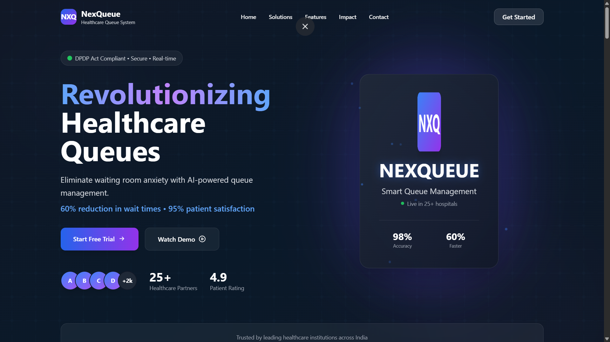

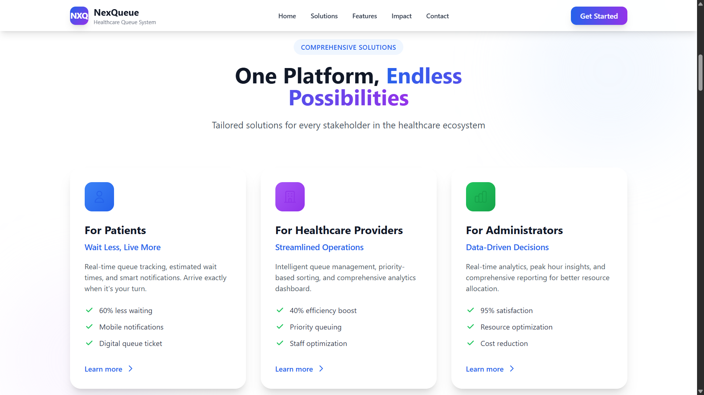

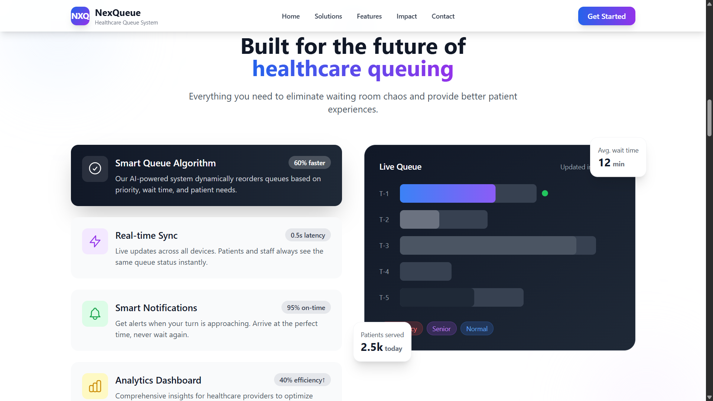

*Netflix-style intro animation with "NXQ" reveal*

### **Patient Dashboard**
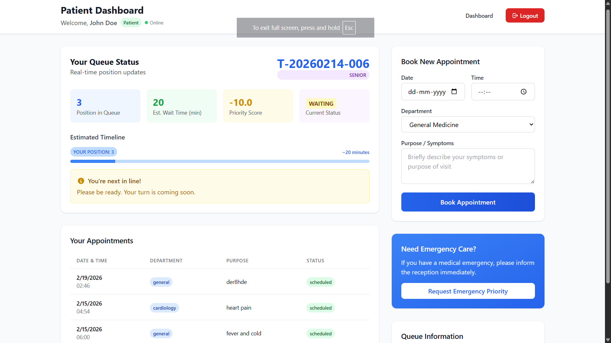

*Real-time queue position with wait time estimate*

### **Staff Dashboard**
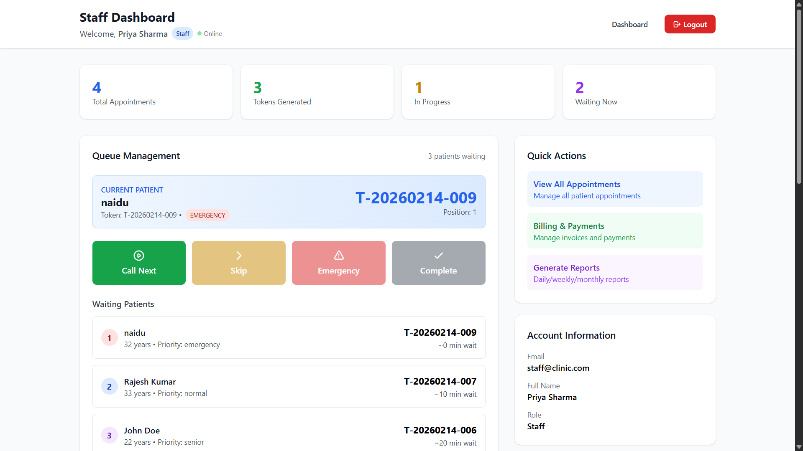

*Priority-sorted queue with one-click controls*

### **Doctor Dashboard**
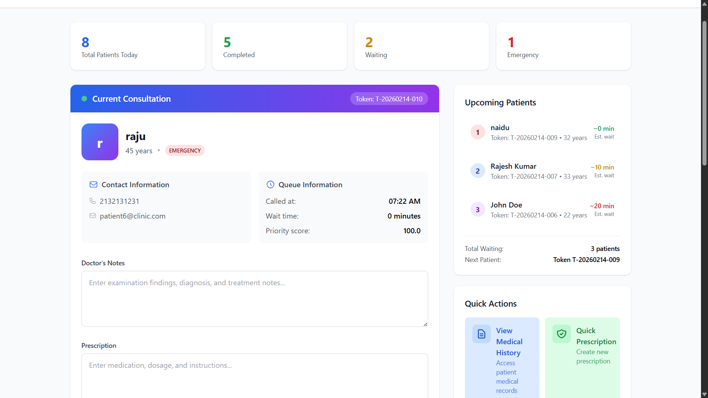

*Current patient view with digital notes and prescription*

### **Lab Queue Dashboard**
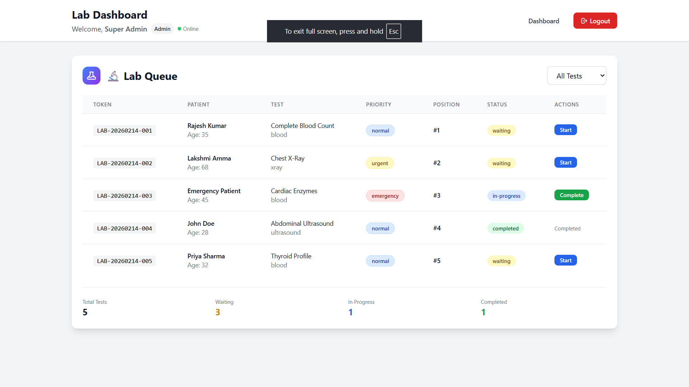

*Lab tests with priority indicators and status tracking*

### **Pharmacy Queue Dashboard**
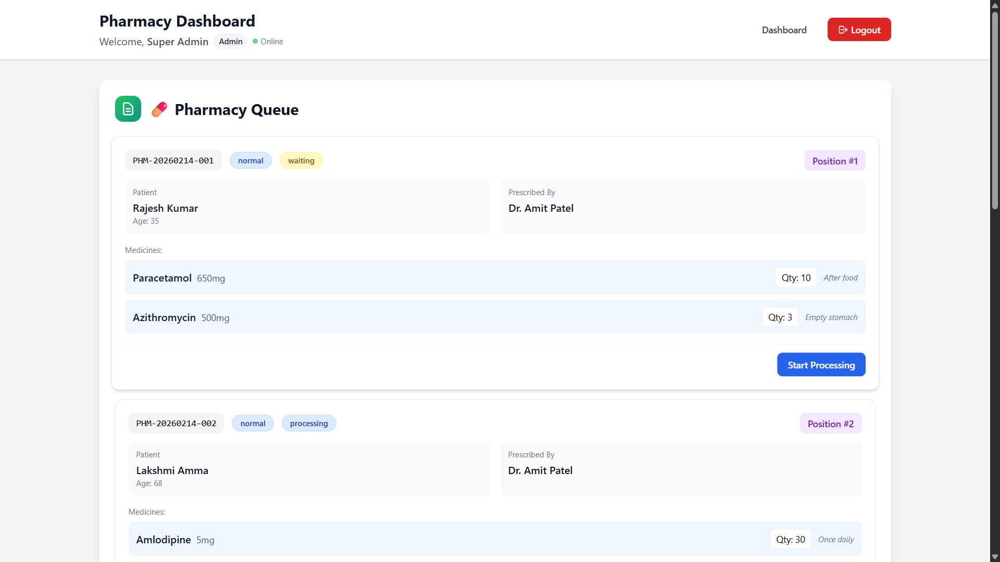

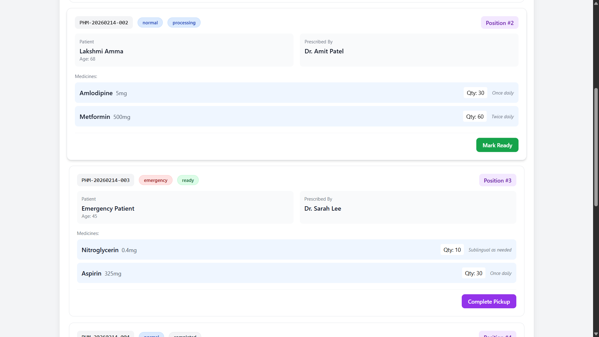

*Prescription management with full workflow*

### **Admin Dashboard**
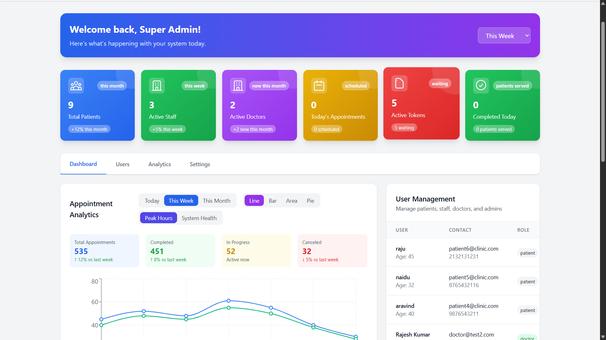

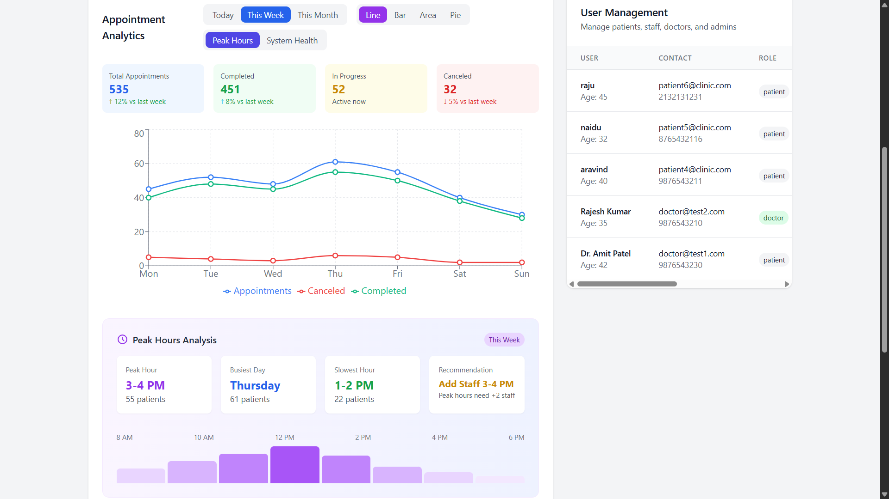

*System analytics, user management, and peak hours analysis*

---

## 🚀 **Live Demo**

## 🚀 Demo Access

### **Live Deployment (In Progress)**
| **Component** | **Status** | **URL** |
|--------------|------------|---------|
| Frontend | 🚧 In Progress | [https://nexqueue.vercel.app](https://nexqueue.vercel.app) |
| Backend API | 🚧 In Progress | [https://nexqueue-backend.onrender.com](https://nexqueue-backend.onrender.com) |

### **Local Development (Working Now)**
| **Dashboard** | **URL** | **Credentials** |
|--------------|---------|-----------------|
| **Patient** | `http://localhost:5173/patient` | `rajesh@test.com` / `patient123` |
| **Staff** | `http://localhost:5173/staff` | `staff@test.com` / `staff123` |
| **Doctor** | `http://localhost:5173/doctor` | `doctor@test.com` / `doctor123` |
| **Lab** | `http://localhost:5173/lab` | `lab@test.com` / `staff123` |
| **Pharmacy** | `http://localhost:5173/pharmacy` | `pharmacy@test.com` / `staff123` |
| **Admin** | `http://localhost:5173/admin` | `admin@nexqueue.com` / `admin123` |
---

## 💻 **Installation**

### **Prerequisites**
- Node.js v18+
- MongoDB (local or Atlas)
- Git

### **Step 1: Clone the Repository**
```bash
git clone https://github.com/yourusername/nexqueue.git
cd nexqueue
```

### **Step 2: Clone the Repository**
```bash
cd backend
npm install
```
### **Step 3: Configure Backend Environment**
## Create backend/.env:
```bash
PORT=5000
MONGODB_URI=mongodb://localhost:27017/nexqueue
JWT_SECRET=your_super_secret_key
```

### **Step 4: Install Frontend Dependencies**
```bash
cd ../frontend
npm install
```

### **Step 5: Configure Frontend Environment**
## Create frontend/.env:
```bash
VITE_API_URL=http://localhost:5000/api
```
### **Step 6: Run the Application**
## Terminal 1 - Backend:
```bash
cd backend
npm run dev
```

## Terminal 2 - Frontend:
```bash
cd Frontend
npm run dev
```
### **Step 7: Access the Application**

## Open http://localhost:5173

## 👥 User Roles

| Role            | Access Route | Permissions |
|-----------------|-------------|-------------|
| Patient         | `/patient`  | Book appointments, view queue, get notifications |
| Staff           | `/staff`    | Manage queue, call patients, emergency override |
| Doctor          | `/doctor`   | Consult patients, add notes, create prescriptions |
| Lab Staff       | `/lab`      | View and process lab tests |
| Pharmacy Staff  | `/pharmacy` | Process medicine prescriptions |
| Admin           | `/admin`    | Full system control, user management, analytics |


## 📊 How It Works

### 🧠 Smart Priority Algorithm

```javascript
const priorityScore = {
  emergency: 100,  // 🚨 Jumps to front
  senior: 50,      // 👵 Fair priority
  normal: 10 + (waitingMinutes * 0.1)  // 👤 Waiting boost
};
```

This ensures:
- 🚨 Emergency patients get immediate attention  
- 👵 Senior citizens receive fair priority  
- 👤 Normal patients gradually move up based on waiting time  

---

### 🏥 Complete Patient Journey

```
┌─────────────┐    ┌─────────────┐    ┌─────────────┐    ┌─────────────┐
│  Patient    │ -> │   Staff     │ -> │   Doctor    │ -> │ Lab/Pharmacy│
│  Books      │    │  Calls      │    │  Consults   │    │  Processes  │
└─────────────┘    └─────────────┘    └─────────────┘    └─────────────┘
```

1. **Patient** books an appointment  
2. **Staff** manages and calls patients  
3. **Doctor** consults and adds prescriptions  
4. **Lab/Pharmacy** processes tests and medicines  

---

## 🌐 Deployment (IN PROGRESS)

### 🚀 Frontend (Vercel)

```bash
cd frontend
npm run build
vercel --prod
```

---

### ⚙️ Backend (Render)

1. Push backend code to GitHub  
2. Connect repository to Render  
3. Add environment variables  
4. Deploy  

---

### 🗄️ Database (MongoDB Atlas)

1. Create a free cluster  
2. Get your connection string  
3. Update `MONGODB_URI` in backend `.env` file  

---

## 📄 License

This project is licensed under the **MIT License** – see the `LICENSE` file for details.

---

## 👨‍💻 Team

**Shiva Kumar Kanneboina** – Full Stack Developer 

**Gurutej Ganapurapu** – Team Leader

**Nandu Kankala** - Pitch Presenter

---

## 🙏 Acknowledgments

- **IIT Delhi Research (2022)** – Fatma & Ramamohan's paper on real-time length-of-stay predictions in Indian PHCs, which showed patients spend 60 minutes in facilities for just 10 minutes of care [ICORES 2022, DOI: 10.5220/0010837400003117]

- **Human Rights Forum, Hyderabad (Jan 2026)** – Their report on Osmania General Hospital, where an accident victim waited three hours with a broken leg, directly inspired our mission [Deccan Chronicle, The Hindu]

- **All the patients who shared their waiting room stories** – Your experiences reminded us that healthcare is about dignity, not just data

---

## 📞 Contact
 
🐙 GitHub: https://github.com/yourusername/nexqueue  
🌍 Live Demo: https://nexqueue.vercel.app (in progress)
💼 LinkedIn: https://www.linkedin.com/in/shiva-kumar-kannaeboina-b6a844298?utm_source=share&utm_campaign=share_via&utm_content=profile&utm_medium=android_app 
---

<p align="center">
  <pre>
███╗   ██╗███████╗██╗  ██╗ ██████╗ ██╗   ██╗███████╗██╗   ██╗███████╗
████╗  ██║██╔════╝╚██╗██╔╝██╔═══██╗██║   ██║██╔════╝██║   ██║██╔════╝
██╔██╗ ██║█████╗   ╚███╔╝ ██║   ██║██║   ██║█████╗  ██║   ██║█████╗  
██║╚██╗██║██╔══╝   ██╔██╗ ██║▄▄ ██║██║   ██║██╔══╝  ██║   ██║██╔══╝  
██║ ╚████║███████╗██╔╝ ██╗╚██████╔╝╚██████╔╝███████╗╚██████╔╝███████╗
╚═╝  ╚═══╝╚══════╝╚═╝  ╚═╝ ╚══▀▀═╝  ╚═════╝ ╚══════╝ ╚═════╝ ╚══════╝
  </pre>
</p>

<p align="center">
  <strong>NEXQUEUE</strong>
</p>

<p align="center">
  <strong>Skip the Queue. Meet the Cure.</strong>
</p>

<p align="center">
  A real-time, priority-based healthcare queue management system reducing waiting time by 60%
</p>

<p align="center">
  <a href="#-features">Features</a> •
  <a href="#-tech-stack">Tech Stack</a> •
  <a href="#-quick-start">Quick Start</a> •
  <a href="#-demo">Demo</a>
</p>

